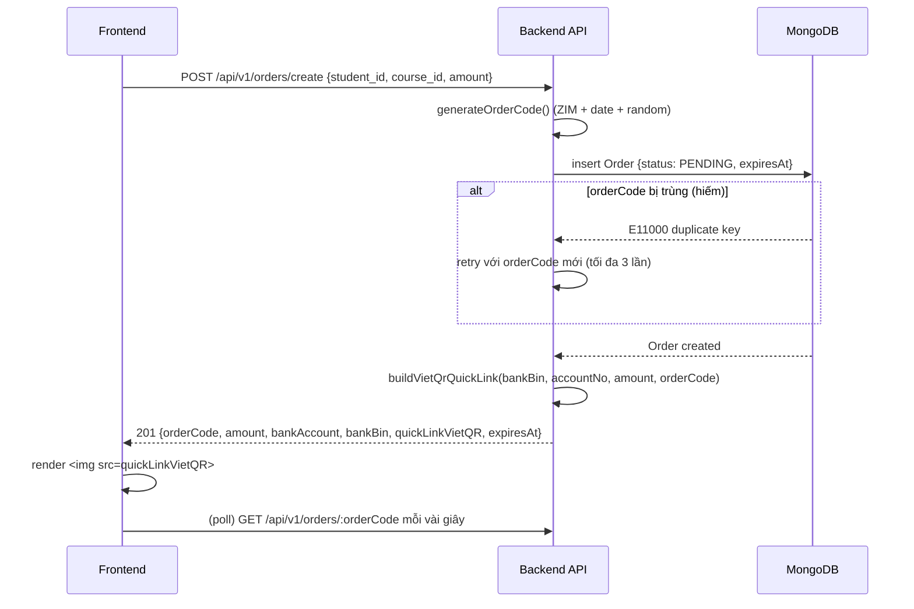
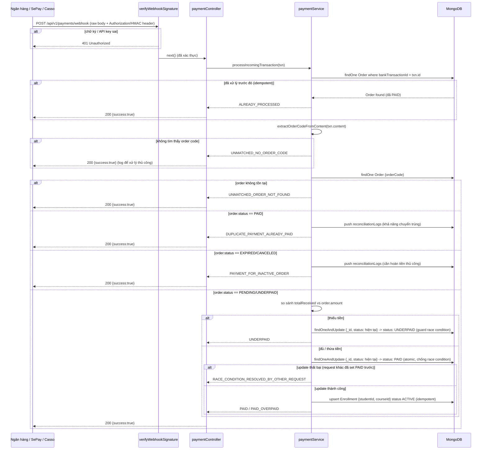
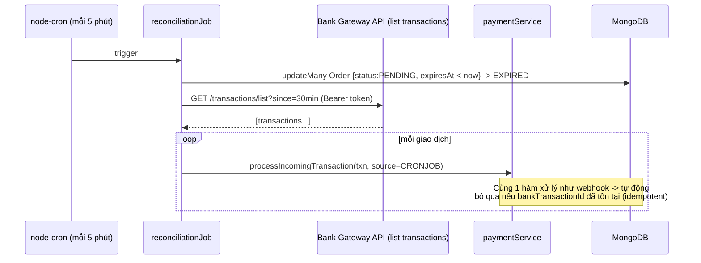
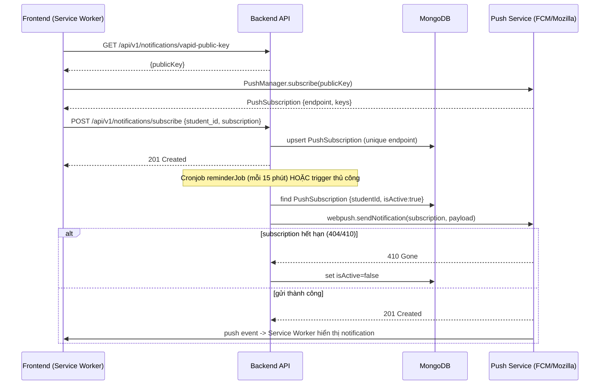

# Sequence Diagrams — ZIM Academy Backend 3

## 1. Tạo đơn hàng & render VietQR

## 2. Webhook thanh toán — đối soát tự động

## 3. Cronjob đối soát backup (khi webhook bị lỡ)

## 4. Web Push — subscribe & gửi nhắc bài tập

